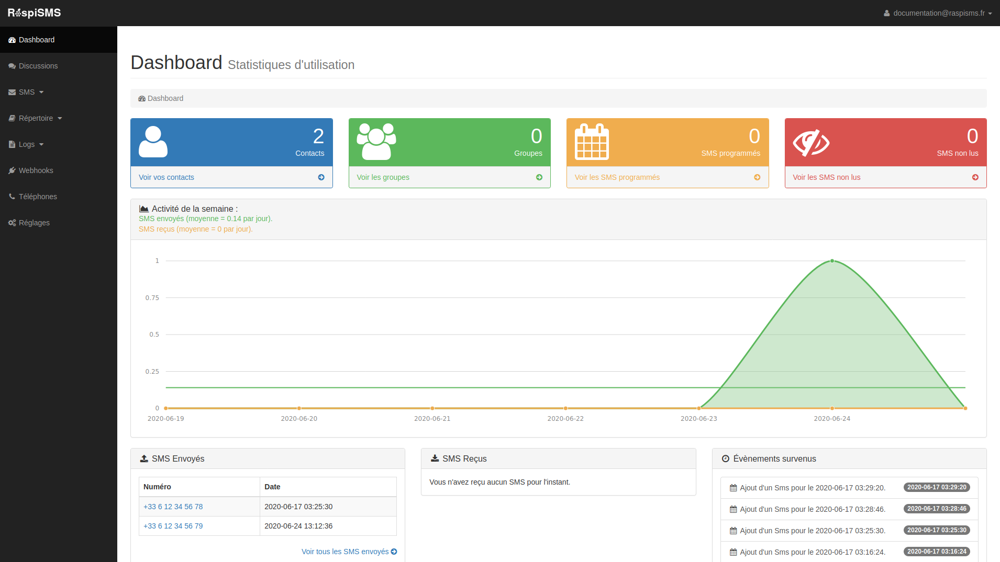

# RaspiSMS

RaspiSMS est une application web d'envoi et de réception de SMS, avec gestion des contacts et des groupes, le support de listes de diffusion dynamiques ou de SMS personnalisés.

L'application est compatible avec de nombreux services, depuis les API HTTP tiers jusqu'à l'utilisation d'un modem GSM avec une carte SIM.

L'application est sous licence libre et est disponible en auto-hébergement ou [**en mode SaaS**](https://raspisms.fr)

## Installation

L'application n'est supportée officiellement que sur les distributions Linux à base Debian via un paquet .deb. Il est néanmoins possible de l'installer sur toute autre distribution utilisant systemd.

[Voir les instructions d'installation](https://raspisms.fr/download/).

## Exemples d'utilisation

Voici quelques exemples d'utilisation de RaspiSMS

- Envoyer et recevoir des SMS personnels depuis un ordinateur.
- Envoyer des messages à des listes de diffusions et proposer une interface unifier pour gérer les communcations d'une association par SMS.
- Effectuer des campagnes de communication par SMS.
- Intégrer à une application pour l'envoi de notifications par SMS.
- Déclencher des commandes systèmes par SMS et contrôler une machine sans accès internet.

## Documentation

La documentation de RaspiSMS est disponible [sur le site officiel](https://documentation.raspisms.fr/).

## Offre SaaS

Si vous ne pouvez pas ou ne souhaitez pas héberger vous même l'application, nous proposons [une offre SaaS à 10€/mois](https://raspisms.fr/price/).

C'est aussi un moyen simple de nous remercier pour notre travail et de financer le développement du projet. 

## Meta

RaspiSMS est un logiciel créé par https://raspberry-pi.fr – [@RaspberryPiFR](https://twitter.com/raspberrypifr) – raspbianfrance@gmail.com

Site officiel du projet : https://raspisms.fr.

Distribué sous license GNU/GPLv3. Voir ``LICENSE`` pour plus d'informations.

## Contribuer au projet

1. Forkez le projet
2. Créez votre propre branche (`git checkout -b feature/fooBar`)
3. Vérifier que vos changements respectent les règles de style avec l'outil ``tests/php-cs-fixer`` et ``tests/phpstan``.
4. Commitez vos changements (`git commit -am 'Add some fooBar'`)
5. Poussez sur la branche (`git push origin feature/fooBar`)
6. Créez une nouvelle Pull Request

